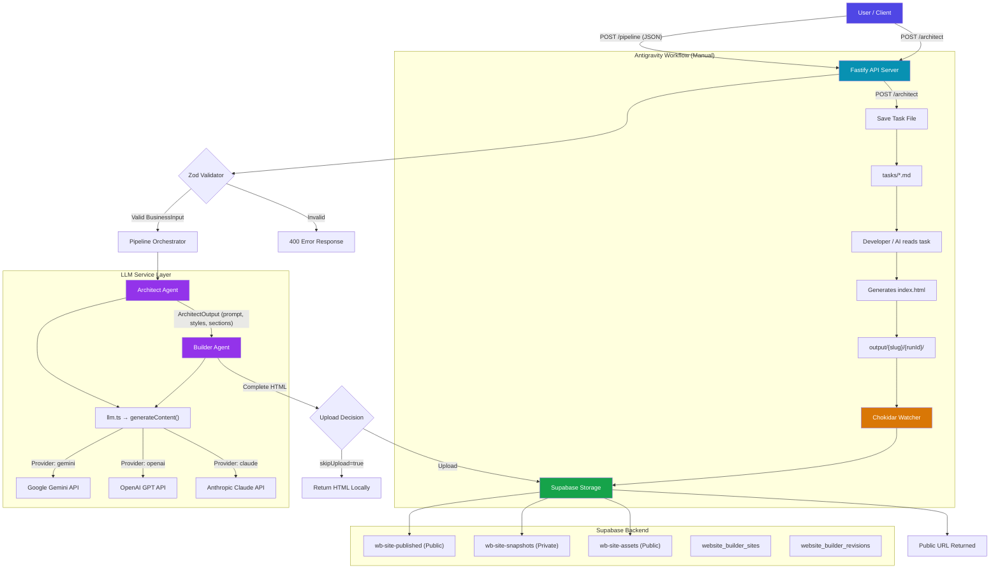

# Architecture

## High-Level Overview

The Website Builder Pipeline uses a **Two-Agent AI** pattern to generate complete, production-ready business websites from structured JSON input.

| Agent | Role | LLM Provider |
|---|---|---|
| **Architect** | Analyzes business data, generates a detailed website specification (prompt, style guidelines, page sections) | Configurable (`gemini` / `openai` / `claude`) |
| **Builder** | Receives the Architect's specification and generates a complete, standalone HTML file | Configurable (`gemini` / `openai` / `claude`) |

The agents' LLM providers are independently configurable via environment variables (`ARCHITECT_LLM_PROVIDER`, `BUILDER_LLM_PROVIDER`), enabling mix-and-match strategies such as Gemini for planning and Claude for code generation.

---

## Tech Stack

| Layer | Technology | Purpose |
|---|---|---|
| **Runtime** | Node.js (ESM) + TypeScript | Core language and module system |
| **HTTP Server** | Fastify | API endpoints with CORS support |
| **Validation** | Zod | Schema validation for input, output, and results |
| **AI / LLM** | Google Generative AI, OpenAI, Anthropic | Multi-provider content generation |
| **Database** | Supabase (PostgreSQL) | Site records, revisions, metadata |
| **Storage** | Supabase Storage | HTML hosting and asset management |
| **File Watcher** | Chokidar | Auto-detects new HTML files and uploads to Supabase |
| **CLI Parsing** | Minimist | Argument parsing for admin scripts |

---

## System Diagram



---

## Folder Structure

```
website-pipeline-api/
├── src/
│   ├── bridge-server.ts          # Fastify HTTP server (5 endpoints)
│   ├── watcher.ts                # Chokidar file watcher → auto-upload
│   │
│   ├── agents/
│   │   ├── architect.ts          # Architect Agent (runArchitect, mockArchitect)
│   │   ├── builder.ts            # Builder Agent (runBuilder, mockBuilder)
│   │   └── index.ts              # Barrel exports
│   │
│   ├── pipeline/
│   │   ├── orchestrator.ts       # 4-phase pipeline (validate → architect → build → upload)
│   │   └── index.ts              # Barrel export
│   │
│   ├── schemas/
│   │   ├── business-input.ts     # Zod schema: BusinessInput validation
│   │   ├── architect-output.ts   # Zod schema: ArchitectOutput (prompt, styles, sections)
│   │   ├── pipeline-result.ts    # Zod schema: PipelineResult (success/error)
│   │   └── index.ts              # Barrel exports
│   │
│   └── services/
│       ├── llm.ts                # Multi-provider LLM abstraction (Gemini/OpenAI/Claude)
│       ├── supabase.ts           # Supabase client, uploadWebsite, bucket checks
│       ├── database.ts           # CRUD for sites/revisions, storage bucket ops
│       ├── slugify.ts            # URL-safe slug generation, runId generation
│       └── index.ts              # Barrel exports
│
├── scripts/
│   ├── importWebsiteBuilderPublishedHtml.ts   # CLI: Import/create site + upload HTML
│   ├── overrideWebsiteBuilderHtml.ts          # CLI: Force-update published/snapshot HTML
│   └── purgeWebsiteFlowUser.ts                # CLI: Purge all data for a user
│
├── output/                       # Generated HTML files (local backup)
├── tasks/                        # Task markdown files for Antigravity workflow
├── .env.example                  # Environment variable template
├── package.json                  # NPM scripts and dependencies
└── tsconfig.json                 # TypeScript configuration
```

### Module Responsibilities

| Module | Purpose |
|---|---|
| `src/agents/` | AI agent implementations. Each agent calls `generateContent()` from the LLM service and parses the response. Both agents have mock variants for testing without API calls. |
| `src/pipeline/` | The orchestrator that sequences all 4 phases: Input Validation → Architect → Builder → Upload. Handles error propagation and contextual logging. |
| `src/schemas/` | Zod validation schemas that define the data contracts between components. Ensures type safety at runtime boundaries. |
| `src/services/` | Infrastructure layer: LLM provider abstraction, Supabase client initialization, database CRUD operations, storage bucket management, and utility functions. |
| `scripts/` | Administrative CLI tools for lifecycle management. Executed via `ts-node` (not compiled by `tsc`). |

---

## API Endpoints

| Method | Path | Purpose |
|---|---|---|
| `POST` | `/pipeline` | Full automated pipeline: validate → architect → build → upload |
| `POST` | `/architect` | Architect-only: generates task file for manual/Antigravity workflow |
| `POST` | `/upload` | Manual upload of an existing HTML file to Supabase |
| `POST` | `/validate` | Validates business input JSON without running the pipeline |
| `GET` | `/health` | Health check with env configuration status |
