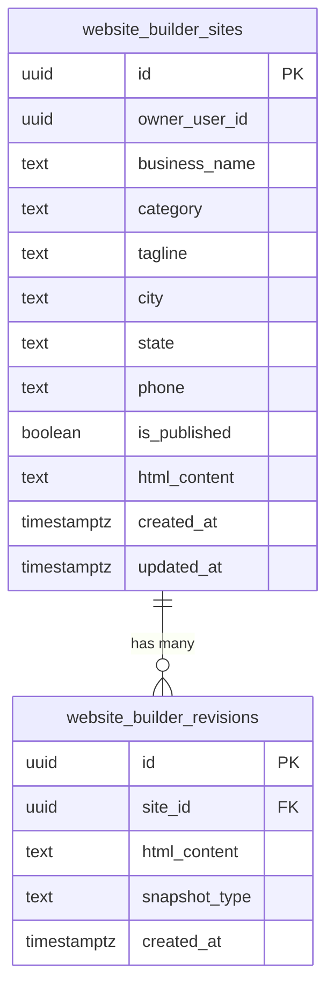

# Database Schema

This document describes the Supabase backend infrastructure that supports the Website Builder Pipeline.

---

## Tables

### `website_builder_sites`

The primary table storing website records. Each row represents one generated business website.

| Column | Type | Nullable | Default | Description |
|---|---|---|---|---|
| `id` | UUID | No | `gen_random_uuid()` | Primary key |
| `owner_user_id` | UUID | No | — | User who owns this site (indexed) |
| `business_name` | Text | No | — | Business name |
| `category` | Text | No | — | Business category (e.g. "optical", "restaurant") |
| `tagline` | Text | Yes | `NULL` | Short tagline for the business |
| `city` | Text | Yes | `NULL` | City of the business |
| `state` | Text | Yes | `NULL` | State of the business |
| `phone` | Text | Yes | `NULL` | Contact phone number |
| `is_published` | Boolean | Yes | `false` | Whether the site is currently live |
| `html_content` | Text | Yes | `NULL` | Full HTML content of the published site |
| `created_at` | Timestamptz | Yes | `now()` | Record creation timestamp |
| `updated_at` | Timestamptz | Yes | `now()` | Last update timestamp (auto-updated via trigger) |

**Indexes:**
- Primary key on `id`
- `idx_wb_sites_owner_user_id` — B-tree index on `owner_user_id` for fast user lookups

**Trigger:**
- `trg_wb_sites_updated_at` — Automatically sets `updated_at = now()` on every UPDATE

> **Note**: This table also contains additional Daytona-related columns (`sandbox_id`, `repo_root`, `dev_port`, etc.) from the original project setup. These are retained for backward compatibility and are not used by the CLI scripts.

---

### `website_builder_revisions`

Stores snapshot/revision history for website content. Each row represets a point-in-time copy of a site's HTML.

| Column | Type | Nullable | Default | Description |
|---|---|---|---|---|
| `id` | UUID | No | `gen_random_uuid()` | Primary key |
| `site_id` | UUID | No | — | Foreign key → `website_builder_sites(id)`, `ON DELETE CASCADE` |
| `html_content` | Text | Yes | `NULL` | HTML content of this revision |
| `snapshot_type` | Text | Yes | `'manual'` | Type of snapshot: `manual`, `auto`, or `override` |
| `created_at` | Timestamptz | Yes | `now()` | When this revision was created |

**Relationships:**
- `site_id` → `website_builder_sites(id)` with `ON DELETE CASCADE` (deleting a site automatically deletes all its revisions)

> **Note**: This table also contains legacy columns (`prompt`, `diff_text`, `source_zip_path`, `created_by`) from the original revision system. These are not used by the CLI scripts.

---

### Entity Relationship



---

## Storage Buckets

Three Supabase Storage buckets are used for different types of content:

| Bucket | Visibility | Purpose | Access Pattern |
|---|---|---|---|
| `wb-site-published` | **Public** | Live, published HTML files accessible via URL | Public read, authenticated write |
| `wb-site-snapshots` | **Private** | Internal versioning of HTML revisions | Authenticated read/write only |
| `wb-site-assets` | **Public** | Images, media, and static assets | Public read, authenticated write |

### Bucket Constants

These are defined in `src/services/database.ts`:

```typescript
export const BUCKET_PUBLISHED = "wb-site-published";
export const BUCKET_SNAPSHOTS = "wb-site-snapshots";
export const BUCKET_ASSETS    = "wb-site-assets";
```

### File Path Conventions

Files are organized by site ID within each bucket:

```
wb-site-published/
└── {site_id}/
    └── index.html          # Current published version

wb-site-snapshots/
└── {site_id}/
    ├── 1707753600000.html   # Timestamp-based snapshots
    └── 1707840000000.html

wb-site-assets/
└── {site_id}/
    ├── logo.png
    └── hero-image.jpg
```

> **Note**: The pipeline's `uploadWebsite()` function in `src/services/supabase.ts` uses a separate `websites` bucket with a `{slug}/{timestamp}/index.html` path pattern for the automated pipeline flow. The `wb-site-*` buckets are used by the CLI scripts.

---

## Row Level Security (RLS)

Both tables have **RLS enabled** with the following policies:

### `website_builder_sites` Policies

| Policy | Operation | Rule |
|---|---|---|
| `service_role_all_sites` | ALL | `auth.role() = 'service_role'` — Full access for server-side operations and CLI scripts |
| `users_read_own_sites` | SELECT | `auth.uid() = owner_user_id` — Users can only read their own sites |
| `website_builder_sites_insert_own` | INSERT | Authenticated users can insert |
| `website_builder_sites_update_own` | UPDATE | `owner_user_id = auth.uid()` — Users can only update their own sites |
| `website_builder_sites_read_own` | SELECT | `owner_user_id = auth.uid()` — Duplicate read policy (legacy) |

### `website_builder_revisions` Policies

| Policy | Operation | Rule |
|---|---|---|
| `service_role_all_revisions` | ALL | `auth.role() = 'service_role'` — Full access for server-side operations |
| `users_read_own_revisions` | SELECT | `site_id IN (SELECT id FROM website_builder_sites WHERE owner_user_id = auth.uid())` — Users can read revisions of their own sites |
| `website_builder_revisions_insert_own` | INSERT | Authenticated users can insert |
| `website_builder_revisions_read_own` | SELECT | Same subquery join as above (legacy) |

> **Important**: The CLI scripts use the `SUPABASE_SERVICE_ROLE_KEY` which bypasses RLS entirely. The RLS policies are designed to protect data when accessed through the Supabase client libraries with user tokens (anon key + JWT).

---

## Service Layer

The database operations are abstracted in `src/services/database.ts`:

| Function | Description |
|---|---|
| `upsertSite(data)` | Create or update a site record |
| `getSiteById(siteId)` | Fetch a single site by UUID |
| `getSitesByOwner(ownerUserId)` | Fetch all sites for a user |
| `createRevision(siteId, html, snapshotType)` | Create a new revision record |
| `deleteUserSites(ownerUserId)` | Delete all sites and revisions for a user |
| `deleteSiteById(siteId)` | Delete a single site and its revisions |
| `uploadToBucket(bucketName, path, content)` | Upload HTML to any storage bucket |
| `listBucketFiles(bucketName, prefix)` | List all files under a bucket prefix |
| `deleteFromBucket(bucketName, paths)` | Delete files from a bucket |
