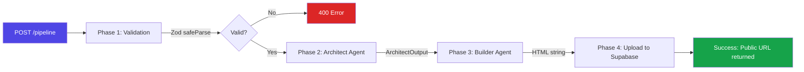
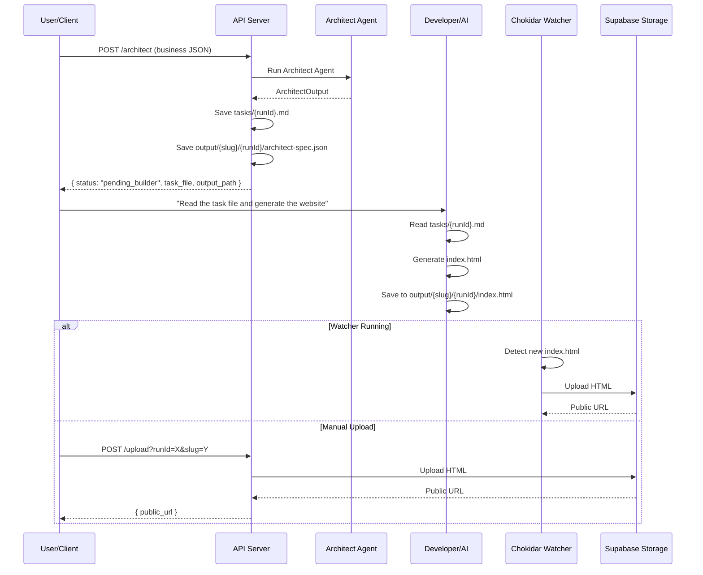

# Workflows

This system supports two distinct workflows for generating business websites.

---

## Flow A: Automated Pipeline (API)

The fully automated flow runs all four pipeline phases in a single API call. No human intervention is required.

### Endpoint

```
POST /pipeline
```

### Query Parameters

| Param | Default | Description |
|---|---|---|
| `mock` | `false` | Use mock agents (no LLM calls, for testing) |
| `skipUpload` | `false` | Skip Supabase upload (save locally only) |

### Request Body

Send a JSON payload matching the `BusinessInput` schema:

```json
{
  "business_name": "Sharma Optics",
  "address": "123 MG Road, Near City Center",
  "city": "Indore",
  "state": "Madhya Pradesh",
  "owner_name": "Atin Sharma",
  "business_category": "optical",
  "description": "Premium optical store offering designer frames, contact lenses, and comprehensive eye examinations...",
  "photos": [
    { "url": "https://picsum.photos/seed/store1/800/600", "alt": "Store exterior" }
  ],
  "phone": "+91 731 4001234",
  "email": "info@sharmaoptics.com",
  "hours": {
    "Monday": "10:00 AM - 8:00 PM",
    "Saturday": "10:00 AM - 9:00 PM",
    "Sunday": "11:00 AM - 6:00 PM"
  }
}
```

### Pipeline Lifecycle



**Phase 1 — Validation**: The input JSON is validated against `BusinessInputSchema` (Zod). Required fields include `business_name`, `address`, `city`, `state`, `business_category`, and `description` (min 20 chars).

**Phase 2 — Architect Agent**: Generates a structured `ArchitectOutput` containing:
- `website_generation_prompt` — a detailed website specification (500+ words)
- `site_style_guidelines` — color palette, fonts, tone, and layout preferences
- `page_sections` — list of required sections (hero, about, services, gallery, testimonials, contact, footer)

**Phase 3 — Builder Agent**: Receives the Architect's output and generates a complete, self-contained HTML file with inline CSS, Tailwind CDN, Google Fonts, animations, and responsive design.

**Phase 4 — Upload**: The HTML is uploaded to Supabase Storage's `websites` bucket. A public URL is returned.

### Success Response

```json
{
  "status": "success",
  "run_id": "run-1707753600000",
  "business_slug": "sharma-optics",
  "storage_path": "sharma-optics/1707753600000/index.html",
  "public_url": "https://abc123.supabase.co/storage/v1/object/public/websites/sharma-optics/...",
  "html_size_bytes": 42560,
  "generated_at": "2026-02-12T08:00:00.000Z"
}
```

### Error Response

```json
{
  "status": "error",
  "run_id": "run-1707753600000",
  "error_message": "Architect Agent failed: GEMINI_API_KEY is not configured",
  "error_phase": "architect"
}
```

The `error_phase` field indicates which pipeline stage failed: `validation`, `architect`, `builder`, or `upload`.

### Example cURL

```bash
# Full pipeline with real LLM
curl -X POST http://localhost:4000/pipeline \
  -H "Content-Type: application/json" \
  -d @test-input.json

# Mock pipeline (no LLM calls)
curl -X POST "http://localhost:4000/pipeline?mock=true" \
  -H "Content-Type: application/json" \
  -d @test-input.json

# Pipeline without upload (local only)
curl -X POST "http://localhost:4000/pipeline?skipUpload=true" \
  -H "Content-Type: application/json" \
  -d @test-input.json
```

---

## Flow B: Antigravity / Manual Workflow

This two-step workflow separates the Architect and Builder phases, allowing a human developer or an AI coding assistant (like Antigravity) to generate the HTML manually.

### Step 1: Generate the Architect Task

```
POST /architect
```

| Query Param | Default | Description |
|---|---|---|
| `mock` | `false` | Use mock architect |

This runs **only** the Architect Agent and saves two files:

| File | Location | Content |
|---|---|---|
| Task file | `tasks/{runId}.md` | Markdown instructions with the architect prompt, output path, and style guidelines |
| Spec file | `output/{slug}/{runId}/architect-spec.json` | Raw JSON output from the Architect Agent |

#### Response

```json
{
  "status": "pending_builder",
  "run_id": "run-1707753600000",
  "business_slug": "sharma-optics",
  "task_file": "tasks/run-1707753600000.md",
  "output_path": "output/sharma-optics/run-1707753600000/index.html",
  "spec_file": "output/sharma-optics/run-1707753600000/architect-spec.json",
  "next_step": "Generate index.html using the architect prompt, then call POST /upload or let watcher auto-upload"
}
```

### Step 2: Generate the HTML

The developer (or AI agent) reads the task file and generates `index.html` at the specified output path:

```
output/{business_slug}/{run_id}/index.html
```

### Step 3: Upload (Choose One)

**Option A — Automatic (Watcher)**

If the watcher is running (`npm run worker`), it will detect the new `index.html` in `output/` and automatically upload it to Supabase Storage.

```bash
# Start the watcher in a separate terminal
npm run worker
```

```
👀 Watcher Active: Waiting for HTML files in: output/
✨ New website detected: output/sharma-optics/run-xxx/index.html
🚀 DEPLOYED TO SUPABASE:
🔗 https://abc123.supabase.co/storage/v1/object/public/websites/...
```

**Option B — Manual Upload Endpoint**

```bash
curl -X POST "http://localhost:4000/upload?runId=run-1707753600000&slug=sharma-optics"
```

Response:
```json
{
  "status": "success",
  "run_id": "run-1707753600000",
  "business_slug": "sharma-optics",
  "public_url": "https://abc123.supabase.co/storage/v1/object/public/websites/...",
  "html_size_bytes": 42560
}
```

### Antigravity Workflow Diagram



---

## Input Validation

Both workflows use the same `BusinessInput` schema. You can validate input independently:

```
POST /validate
```

```bash
curl -X POST http://localhost:4000/validate \
  -H "Content-Type: application/json" \
  -d '{"business_name": "AB"}'
```

Returns validation errors with field paths:
```json
{
  "valid": false,
  "errors": [
    { "field": "address", "message": "Required" },
    { "field": "city", "message": "Required" },
    { "field": "business_category", "message": "Required" },
    { "field": "description", "message": "Required" }
  ]
}
```

### Required Fields

| Field | Type | Constraints |
|---|---|---|
| `business_name` | string | 2–100 characters |
| `address` | string | 5–200 characters |
| `city` | string | 2–50 characters |
| `state` | string | 2–50 characters |
| `business_category` | string | 2–50 characters |
| `description` | string | 20–2000 characters |

### Optional Fields

| Field | Type | Notes |
|---|---|---|
| `owner_name` | string | 2–100 characters |
| `phone` | string | Regex validated: digits, spaces, hyphens, parens |
| `email` | string | Email validated |
| `website` | string | URL validated |
| `photos` | array | Objects with `url` (required), `alt`, `caption` |
| `hours` | object | Key-value pairs: `{ "Monday": "10:00 AM - 8:00 PM" }` |
